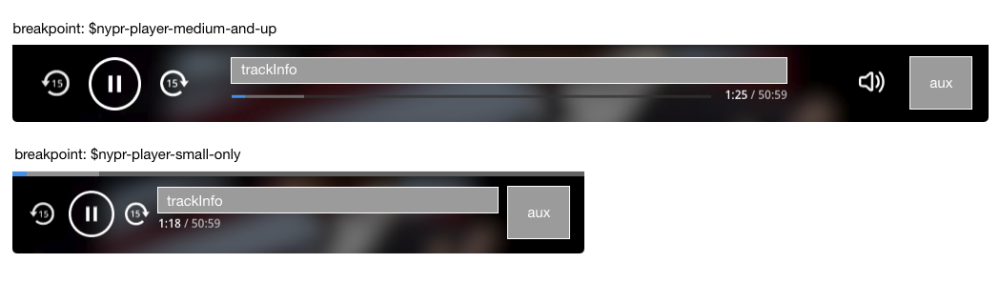

# nypr-player

## New York Public Radio Audio Player

[](https://www.npmjs.com/package/nypr-player) [](https://circleci.com/gh/nypublicradio/nypr-player)

## What is this?

This is the audio player you may have seen on such sites as [wnyc.org](http://wnyc.org), now available for your use.


## Install

```shell
yarn add nypr-player
```

## Basic Usage

This addon exposes a `nypr-player` component that provides a UI to a loaded audio file. The user can provide metadata and inject additional controls into available UI regions.

There are two ways to get a piece of audio into the player interface: you can pass in an argument at render time or you can use the provided `hifi` service to manually load a pice of audio.

### Passing in a piece of audio via template argument
The `nypr-player` component accepts a `sound` parameter which can be a string or a Promise which resolves to a string.

```htmlbars
{{nypr-player sound='https://www.podtrac.com/pts/redirect.mp3/audio.wnyc.org/bl/bl051914bpod.mp3'}}
```

### Manually loading audio using the `hifi` service
If you don't want to show the player immediately or need to otherwise get the player playing from outside its template context, you can use the `hifi` service to manually give it a sound object.

Maybe you've got a play button somewhere that you want to trigger the player. This would do it.

```javascript
// app/components/play-button.js
import Component from 'ember-component';
import service from 'ember-service/inject';

const URL = 'https://www.podtrac.com/pts/redirect.mp3/audio.wnyc.org/otm/otm050517pod.mp3';

export default Component.extend({
  hifi: service(),
  actions: {
    play() {
      this.get('hifi').play(URL);
    }
  }
});
```

```htmlbars
{{! app/templates/components/play-button.htmlbars }}
<button {{action 'play'}}>play this audio</button>
```

```htmlbars
{{! app/templates/application.hbs}}
{{play-button}}

{{nypr-player}}
```

## Styles

Currently, this app requires sass compilation for the player to look correct. Add `ember-cli-sass` to your app and then put this in your `app.scss`:

```scss
@import "nypr-player";
```

### Sass Variables

There are a bunch of values you can override by defining *above* the import line in your app.

```scss
$nypr-player-base-font                       : 16 !default;
$nypr-player-transition-timing               : 100ms !default;
$nypr-player-transition-timing-queue         : 150ms !default;

$nypr-player-medium-breakpoint               : 801;
$nypr-player-medium-and-up                   : "(min-width: #{$nypr-player-medium-breakpoint}px)";
$nypr-player-small-only                      : "(max-width: #{$nypr-player-medium-breakpoint - 1}px)";

$nypr-player-zindex                          : 1200 !default;
$nypr-player-backdrop-zindex                 : -1 !default;

/* Color basics */
$nypr-player-primary-color                   : #FFF !default;
$nypr-player-background-color                : #333 !default;
$nypr-player-accent-color                    : #128cf4 !default;

$nypr-player-background-image-opacity        : 0.5;


/* Color specifics are made out of the button basics */

$nypr-player-floating-queue-button-background: $nypr-player-background-color;
$nypr-player-button-color                    : $nypr-player-primary-color !default;
$nypr-player-button-hover-color              : rgba($nypr-player-primary-color, 0.8) !default;
$nypr-player-button-active-color             : $nypr-player-accent-color !default;
$nypr-player-slider-handle-color             : $nypr-player-accent-color;

$nypr-player-info-text-color                 : $nypr-player-primary-color !default;
$nypr-player-link-underline-color            : $nypr-player-primary-color !default;
$nypr-player-timelabel-color                 : $nypr-player-primary-color !default;
$nypr-player-timelabel-total-color           : rgba($nypr-player-primary-color, 0.6);

$nypr-player-backdrop-color                  : rgba($nypr-player-background-color, 0.75) !default;
$nypr-player-progress-played-color           : $nypr-player-accent-color !default;
$nypr-player-progress-downloaded-color       : rgba($nypr-player-primary-color, 0.7) !default;
$nypr-player-spinner-primary-color           : rgba($nypr-player-primary-color, 0.5) !default;
$nypr-player-spinner-accent-color            : rgba($nypr-player-primary-color, 0.8) !default;
```

## Advanced Usage

Here's a more sophisticated usage of the player.

* `currentTitle` is what the Play/Pause button uses as a tooltip
* `backdropImageUrl` is blurred and stretched across the background of the player

```javascript
{{#nypr-player currentTitle=currentTitle backdropImageUrl=backdropImageUrl as |content|}}
  {{#content.for 'trackInfo'}}
    {{! put your track info here}}
  {{/content.for}}

  {{#content.for 'streamInfo'}}
    {{! put your stream info here (only shows up when the audio source is a stream)}}
  {{/content.for}}

  {{#content.for 'aux' as |args|}}
    {{! auxillary area. This is where WNYC puts their queue button, and chances are you probably will too.}}

    {{args.queueButton
        queueLength  = queueLength
        showModal    = (action 'showQueueModal')
        closeModal   = (action 'closeQueueModal')
        isOpenModal  = queueModal }}
  {{/content.for}}
{{/nypr-player}}
```

### Content Areas

The content areas you saw above show up like this.




## TODO
* dummy app
* document queue button
* allow for customizing position making the player unfixed doesn't require a lot of CSS overrides
* figure out a way so `ember-cli-sass` isn't an upstream requirement
