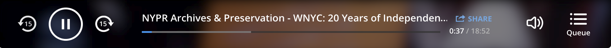

# nypr-player

## New York Public Radio Audio Player

[](https://www.npmjs.com/package/nypr-player) [](https://circleci.com/gh/nypublicradio/nypr-player)

## What is this?

This is the audio player you may have seen on such sites as [wnyc.org](http://wnyc.org), now available for your use.



For more information on usage, please see the docs site at https://nypublicradio.github.io/nypr-player

## Install

```shell
yarn add nypr-player
```

## TODO
* dummy app
* document queue button
* allow for customizing position making the player unfixed doesn't require a lot of CSS overrides
* figure out a way so `ember-cli-sass` isn't an upstream requirement
